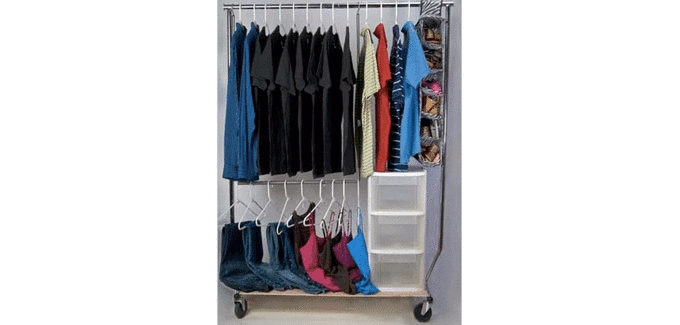
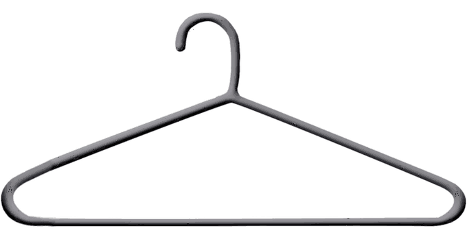
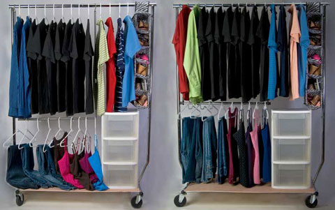
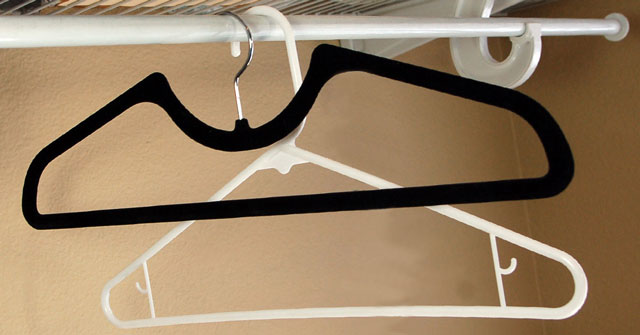
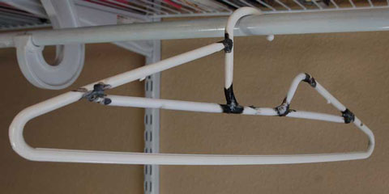
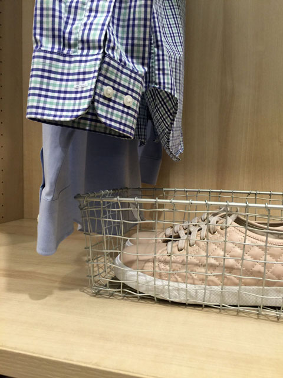
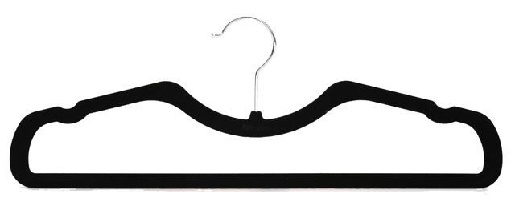
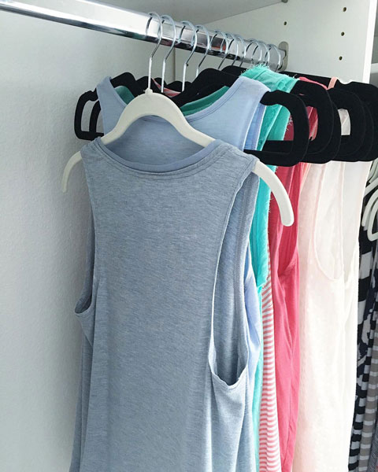
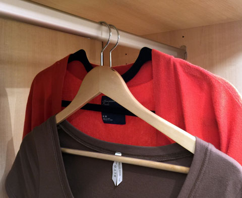
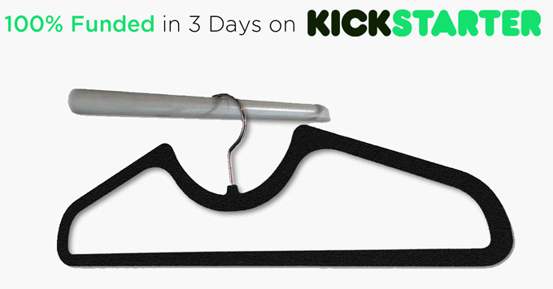

<a href="https://www.dropbox.com/sh/x1qkvtyj5rx2zv3/AAAw3g6eArasRkVASGS4Zryva?dl=0" class="btn btn-primary btn-lg" role="button"><i class="fa fa-cloud-download"></i>  Click Here to Download Entire Media Kit</a>

You may use this page to help you write media articles pertaining to Higher Hangers. All contents of this page, including all text and image files, can be downloaded in one folder using this link: [https://www.dropbox.com/sh/x1qkvtyj5rx2zv3/AAAw3g6eArasRkVASGS4Zryva?dl=0](https://www.dropbox.com/sh/x1qkvtyj5rx2zv3/AAAw3g6eArasRkVASGS4Zryva?dl=0)

<a href="/img/media_kit_instructions.jpg" class="btn btn-warning" role="button"><i class="fa fa-question-circle"></i>  Having trouble downloading? Click here for instructions.</a>

---

## Media Kit Table of Contents

- [Quick Facts & Stats](#facts)
- [Product Description](#product)
- [Inventor Bio](#bio)
- [Press Release](#press)
- [Testimonials](#testimonials)
- [Sample Interview Questions](#interview)
- [Contact Information](#contact)
- [Links & Shareable Media](#links)
- [Included Images](#images)
- [Kickstarter Video and Embed Code](#video)
- [16 Second Youtube Explanation Video](#youtube)

---

## Quick Facts & Stats

Higher Hangers

- Higher Hangers are the first vertical space-saving clothes hanger ever
- Invented by college student Drew Cleaver in his dorm room to save space
- U.S. Patent Number 7,404,503 awarded on first application
- Higher Hangers save 4+ vertical inches over traditional clothes hangers
- Higher Hangers will will create enough new space in an average master bedroom closet for:
    - 11 cubic feet
    - 7 carry-on size suitcases
    - 48 shoe boxes
- [www.HigherHangers.com](http://www.higherhangers.com)

Kickstarter

- Kickstarter Campaign Link: [http://kck.st/1SdfGfN](http://kck.st/1SdfGfN)
- Campaign runs through March 31
- 100% Funded ($40,000) in three days
- Delivery expected within 90 days of campaign close
    
---

## Product Description - Higher Hangers

**Short**

Higher Hangers are clothes hangers reinvented - creating 48 shoeboxes of new space in an average closet. All you do is replace your clothes hangers with Higher Hangers. The patented space-saving geometry increases closet space 100% of the time, and works with all clothing styles including collared shirts.

**Long**

Higher Hangers are clothes hangers reinvented. Since 1869, hangers have had a design flaw that wastes space. We’ve patented a space saving geometry that creates room for 48 shoe boxes in an average closet. All you do is replace your hangers with Higher Hangers. They work by lowering the hanger hook, which raises clothes higher, creating new space underneath. The design maximizes efficiency while retaining function with all styles of clothing, including collared shirts.

[Back to Table of Contents](#table)

---

## Inventor Bio - Drew Cleaver

**Short**

Drew Cleaver invented Higher Hangers while living a cramped new life in his freshman dorm room. His senior year, he and his team won the undergrad D.W. Reynold’s Tri-State Business plan competition with Higher Hangers. After 6 years in oil & gas, Drew left the corporate world to bring Higher Hangers to market. He lives in Denver, Colorado. 

**Long**

Drew Cleaver invented Higher Hangers while living a cramped new life in his freshman dorm room. In 2008, his patent was issued in less than a year after its first application, something unheard of at the time. His senior year, he and his team won the undergrad D.W. Reynold’s Tri-State Business plan competition with Higher Hangers and were awarded nearly $40,000 in cash. 

In 2010 he won a product search competition hosted by a major housewares retailer, but they were not able to bring Higher Hangers to market due to higher than anticipated levels of risk. In 2014 all Higher Hangers intellectual property was returned to Drew. After 6 years in oil & gas, Drew left the corporate world to bring Higher Hangers to market himself. 

Drew attended Cypress Creek High School in Houston, TX and graduated from John Brown University in 2009 with a B.S. in Business Management. He has lived in Denver, Colorado since 2012 and enjoys cycling, skiing, and motorsport. 

[Back to Table of Contents](#table)

---

## Press Release

**Suggested Headlines:**

- **Clothes hangers flawed since 1869. New design saves massive space.**
- **Everyone needs these new space-saving clothes hangers.** 
- **We all need these new space-saving clothes hangers in our closet.**

Have you ever looked at your closet with great despair, only wishing you had a bigger one? Drew Cleaver did the same thing when he moved into his first (pre-war) college dorm room. With no room alterations allowed, Drew had to find a way to make new space out of nothing. 

After gazing at his laughable closet allotment, he noticed something odd. There was a huge gap between his garments and the closet rod. Look in your own closet - see how much of the clothes hangers you can see? 

That’s all wasted space. At that point, Drew invented Higher Hangers. Higher Hangers eliminate all that wasted space by bringing the hanger hook closer to the garment, raising the clothes higher, which creates about 48 shoeboxes of new space in an average closet.

This is not a contraption that you add to your existing toolbox of organizational accessories - Higher Hangers are clothes hangers reinvented. All you do is replace your existing hangers with Higher Hangers. The design maximizes efficiency while retaining function with all styles of clothing, including collared shirts. There is no sacrifice with this amazingly simple yet brilliant “better mousetrap” invention. 

A few years ago, Higher Hangers won an innovative dorm room product search competition hosted by a major housewares retailer. Unfortunately, the retailer underestimated the amount of investment required to bring Higher Hangers to market the way they wanted to, so they ended up returning all the rights back to Drew. 

Now with the advent of crowdfunding, Drew is launching Higher Hangers for the first time on Kickstarter March 1st with an anticipated delivery within 90 days of the campaign’s finish. 

Who What When Where Why How?
Builds or tells your news
Least Important info, company info, ### ending

[Back to Table of Contents](#table)

---

## Testimonials

### Product Testers

When I first discovered Higher Hangers I thought to myself, "Why on earth would anyone buy hangers with the old design?" It's a logical product that offers a quick solution to maximizing closet space. In NYC, where my clients' closets are typically very tight, this is a great product for them to increase shoe storage - something all women want!

Samantha Brown, Professional Stylist, SamanthaBrownStyle.com

As a women's clothing and accessories boutique owner, I'm always searching for hangers that won't damage clothing. Not only are Higher Hangers space-saving, the gentle shoulder design eliminates damage to lightweight knits, sweaters, and cotton garments. I'm now a Higher Hangers customer and will be recommending all of my customers to make the switch.

Elizabeth, Boutique Owner, SouthernHippie.com

We cram two adults, a baby, and a toddler in to a 204 sqft Tiny House! When it comes to space, we think in inches rather than feet, and every single inch matters! Higher Hangers has changed my closet! With the added space we are able to fit more in our teeny tiny closet! I will be forever grateful to Higher Hangers for the added space that we didn't know wasn't there! This design will become the new normal, I'm sure of it.

Baylie Carlson, TinyHouseGrowingFamily.com

As a professional organizer, space planning is a large part of my business. Clients hire me not only to organize, but also to make the most of the space available to them. I can't believe something as simple as Higher Hangers’ design could help me provide more useable space in a closet. Here in San Francisco, closet space is at a premium. Higher Hangers give me the ability to organize and create more space for shelving or shoe storage.

Samantha, Professional Organizer, SimplyOrganized.me

### Pre-Kickstarter Fan Comments

Can't hang my husband's clothes in the house we moved into until we are able to purchase enough Higher Hangers!! - Pam Halaschak

I work with tiny house builders and enthusiasts to help minimalize their stuff--these fit perfectly! (no pun intended...) - Karin Parramore

We would love to see how much space we can save using these. Every inch makes a difference!- Anna Romero

I have been looking for this type of product, specifically for pants--I use kid's hangers because they are higher, but they're not always wide enough. Seriously, every time I am out shopping I look for something like this! - Monica Premo

[Back to Table of Contents](#table)

---

## Sample Interview Questions

- How did you come up with this idea? 
- How do Higher Hangers work compared to normal hangers?
- Is there any issue with collared shirts? 
- What style/material hangers are you offering? 
- What’s been the most difficult part of bringing Higher Hangers to market? 
- Is there any compromise in using Higher Hangers versus traditional hangers?
- Have you had any discussions about licensing deals? 
- Have you thought about going on Shark Tank?  

[Back to Table of Contents](#table)

---

## Contact Information

Drew Cleaver, drew@higherhangers.com

Mailing Address:  
Higher Hangers	 
PO Box 11713 
Denver, CO 80211 
(720) 588-8825

- Instagram: @drew.cleaver, @higherhangers
- www.linkedin.com/in/drewcleaver
- www.higherhangers.com
- www.facebook.com/higherhangers
- www.pinterest.com/higherhangers
- Kickstarter campaign short URL
- http://kck.st/1SdfGfN
- Kickstarter campaign long URL
- https://www.kickstarter.com/projects/higherhangers/higher-hangers-space-saving-closet-organization-re

[Back to Table of Contents](#table)

---

## Links & Shareable Media

- Short Kickstarter Link: `http://kck.st/1SdfGfN`
- Full Kickstarter Link: `https://www.kickstarter.com/projects/higherhangers/higher-hangers-space-saving-closet-organization-re`
- [Click Here to Share on Facebook](https://www.facebook.com/sharer/sharer.php?u=https://www.kickstarter.com/projects/higherhangers/higher-hangers-space-saving-closet-organization-re)
    - Raw URL: `https://www.facebook.com/sharer/sharer.php?u=https://www.kickstarter.com/projects/higherhangers/higher-hangers-space-saving-closet-organization-re`
- [Click Here to Tweet on Twitter](https://twitter.com/home?status=100%25%20Funded%20on%20Kickstarter%20in%203%20Days!%20Higher%20Hangers%20are%20the%20first%20vertical-space%20saving%20hangers%20EVER!%20http%3A//kck.st/1SdfGfN)
    - Raw URL: `https://twitter.com/home?status=100%25%20Funded%20on%20Kickstarter%20in%203%20Days!%20Higher%20Hangers%20are%20the%20first%20vertical-space%20saving%20hangers%20EVER!%20http%3A//kck.st/1SdfGfN`
- [Click Here to Pin on Pinterest](https://pinterest.com/pin/create/button/?url=http%3A//kck.st/1SdfGfN&media=http%3A//www.higherhangers.com/img/funded_on_kickstarter.png&description=Now%20on%20Kickstarter%3A%20Genius%20hanger%20saves%20vertical%20space%20in%20your%20closet.%20Creates%20enough%20new%20space%20for%2048%20more%20shoe%20boxes!)
    - Raw URL: `https://pinterest.com/pin/create/button/?url=http%3A//kck.st/1SdfGfN&media=http%3A//www.higherhangers.com/img/funded_on_kickstarter.png&description=Now%20on%20Kickstarter%3A%20Genius%20hanger%20saves%20vertical%20space%20in%20your%20closet.%20Creates%20enough%20new%20space%20for%2048%20more%20shoe%20boxes!`
        
Click here to follow on Instagram
Youtube Video - 16 Sec Illustration with Commentary:
https://www.youtube.com/watch?v=qW0g6n4ogtw 

[Back to Table of Contents](#table)

---

## Included Images

Multiple sizes of all images are included in the media kit folder, downloadable at [https://www.dropbox.com/sh/x1qkvtyj5rx2zv3/AAAw3g6eArasRkVASGS4Zryva?dl=0](https://www.dropbox.com/sh/x1qkvtyj5rx2zv3/AAAw3g6eArasRkVASGS4Zryva?dl=0)

  

    
  

  

    
  

  

    
  

  

    
  

  

    
  

  

    
  

  

    
  

  

    
  

  

    
  

  

    
  

  

    
  

  

    
  

  

    
  

  

    
  

  

    
  

  

    
  

  

  
  

  

  

[Back to Table of Contents](#table)

---

## Kickstarter Video & Embed Code

### 480 x 360 Video & Code

Embed Code:

`<iframe width="480" height="360" src="https://www.kickstarter.com/projects/higherhangers/higher-hangers-space-saving-closet-organization-re/widget/video.html" frameborder="0" scrolling="no"> </iframe>`

<iframe width="480" height="360" src="https://www.kickstarter.com/projects/higherhangers/higher-hangers-space-saving-closet-organization-re/widget/video.html" frameborder="0" scrolling="no"> </iframe>

---

### 640 x 480 Video & Code

Embed Code:

`<iframe width="640" height="480" src="https://www.kickstarter.com/projects/higherhangers/higher-hangers-space-saving-closet-organization-re/widget/video.html" frameborder="0" scrolling="no"> </iframe>`

<iframe width="640" height="480" src="https://www.kickstarter.com/projects/higherhangers/higher-hangers-space-saving-closet-organization-re/widget/video.html" frameborder="0" scrolling="no"> </iframe>

---

### 800 x 600 Video & Code

Embed Code:

`<iframe width="800" height="600" src="https://www.kickstarter.com/projects/higherhangers/higher-hangers-space-saving-closet-organization-re/widget/video.html" frameborder="0" scrolling="no"> </iframe>`

<iframe width="800" height="600" src="https://www.kickstarter.com/projects/higherhangers/higher-hangers-space-saving-closet-organization-re/widget/video.html" frameborder="0" scrolling="no"> </iframe>

[Back to Table of Contents](#table)

---

## 16 Second Youtube Explanation Video

Youtube link: [https://www.youtube.com/watch?v=qW0g6n4ogtw](https://www.youtube.com/watch?v=qW0g6n4ogtw ) 

### 560 x 315 Video

Embed code: `<iframe width="560" height="315" src="https://www.youtube.com/embed/qW0g6n4ogtw?rel=0" frameborder="0" allowfullscreen></iframe>`

<iframe width="560" height="315" src="https://www.youtube.com/embed/qW0g6n4ogtw?rel=0" frameborder="0" allowfullscreen></iframe>

### 640 x 360 Video

Embed code: `<iframe width="640" height="360" src="https://www.youtube.com/embed/qW0g6n4ogtw?rel=0" frameborder="0" allowfullscreen></iframe>`

<iframe width="640" height="360" src="https://www.youtube.com/embed/qW0g6n4ogtw?rel=0" frameborder="0" allowfullscreen></iframe>

### 853 x 480 Video

Embed code: `<iframe width="853" height="480" src="https://www.youtube.com/embed/qW0g6n4ogtw?rel=0" frameborder="0" allowfullscreen></iframe>`

<iframe width="853" height="480" src="https://www.youtube.com/embed/qW0g6n4ogtw?rel=0" frameborder="0" allowfullscreen></iframe>

### 1280 x 720 Video

Embed code: `<iframe width="1280" height="720" src="https://www.youtube.com/embed/qW0g6n4ogtw?rel=0" frameborder="0" allowfullscreen></iframe>`

<iframe width="1280" height="720" src="https://www.youtube.com/embed/qW0g6n4ogtw?rel=0" frameborder="0" allowfullscreen></iframe>

[Back to Table of Contents](#table)

